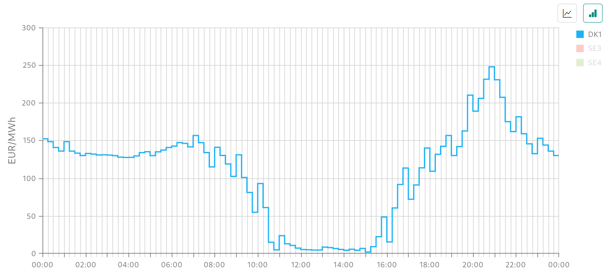

# Time Series Forecasting
A quick demo to explore the world of time series forecasting (TSF), with a real world experiment in the field of electricity price forecasting (EPF).

The script contains the code to download the datasets, apply some pre-processin and then execute the models. 

Three different models are compared: a DNN with Quantile Regression head, a Gaussian DNN and a Mixture of Gaussian DNN's. 

## Why bother with Electricity price forecasting?

Electricity price forecasting is fundamental to plan how much energy we will try to buy the next day, at which price and how to schedule the machines. 

Uncertainty quantification is also fundamental since based on the confidence that we have for our predictions, we can make decisions based on that. 

Example of spot market price: Belgium 22/05/2026

COLAB LINK: https://colab.research.google.com/drive/1pg99-YFM5Ct6F-Bvwygi4MR3l-5xgvkF?usp=sharing

